# 教室で使えるかもしれないもの作り #◯ 「せんせい、なにを書けばいいの」で止まらない。書き出しのことばが出てくるふりかえりアプリ「ふりかえりジャーナル」

## 🏫 はじめに

一日の終わりに、ふりかえりを書かせる。
やってみると、思っていたよりむずかしくないでしょうか。

書ける子はどんどん書きます。けれど何人かは、えんぴつを持ったまま止まってしまいます。「なにを書けばいいの」と聞かれて、「今日がんばったことでいいよ」と答えても、また止まる。そのあいだにも、こちらは机の間を回らないといけません。

そして集めたあと。ノートを持ち帰って、ひとりずつ読んで、赤ペンでひとこと書く。それを毎日となると、正直つづきません。返せなかったノートが職員室に積まれて、こちらの気持ちのほうが重くなっていく。

書くほうも、返すほうも、しんどい。だから週に一回になり、月に一回になり、いつのまにか消えていく。ふりかえりが大事なことはみんな分かっているのに、そうなってしまいます。

そこを、少しでもなだらかにしたくて作ったのが「ふりかえりジャーナル」です。子どもの画面には書き出しのことばが出てきます。先生の画面には、スタンプをひとつ押すだけで返せる道が用意してあります。毎日の五分が、無理なく回るところまで軽くするのが狙いです。

作ったものはここに置いてあります。

https://github.com/GIGAyama/Reflection_Journal

先生も子どもも、Googleアカウントがあれば使えます。アプリを入れる必要も、パスワードを配る必要もありません。

## 📱 このアプリでできること

先生の画面から見ていきます。共通のURLを開いてGoogleでサインインすると、この画面が出ます。

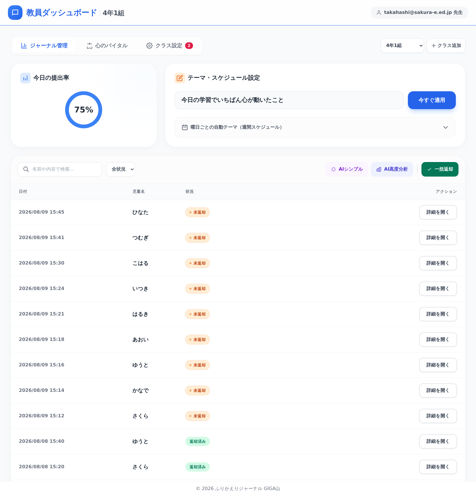

今日の提出率がまるいグラフで出て、その横で今日のテーマを決められます。上のタブは三つだけです。

テーマは、その日その日で入れてもいいのですが、毎日考えるのは大変です。折りたたみを開くと、月曜から金曜まで、曜日ごとのテーマをしまっておけます。その日のテーマを入れ忘れた朝は、こちらが自動で出ます。

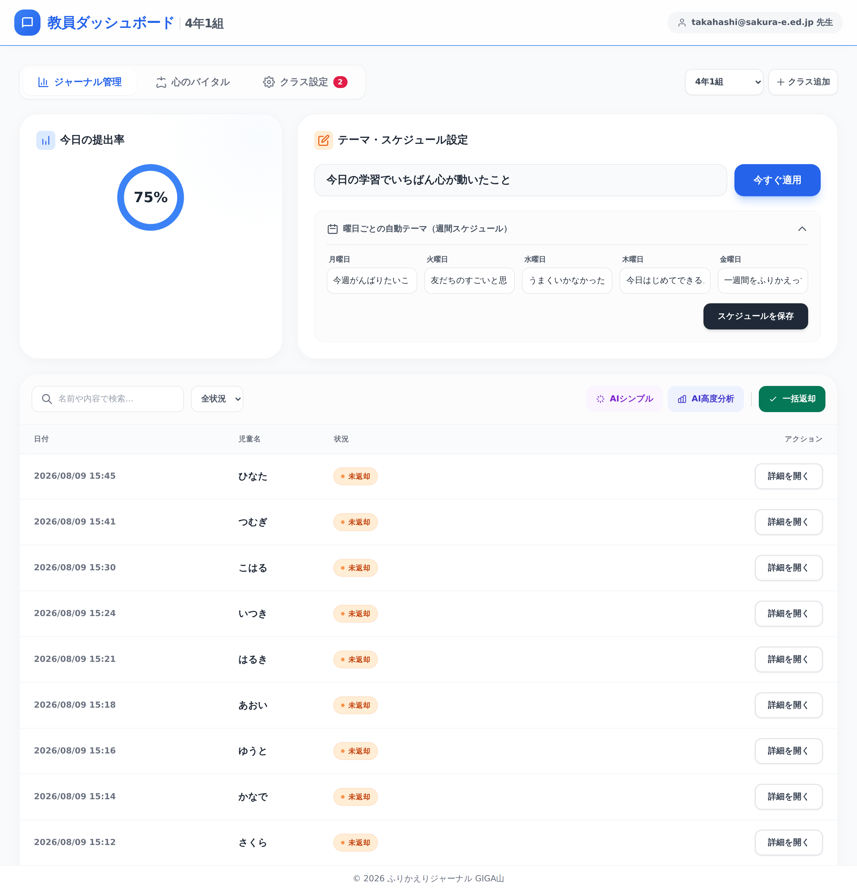

下には提出が新しい順に並びます。名前や本文で検索でき、未返却だけにしぼることもできます。

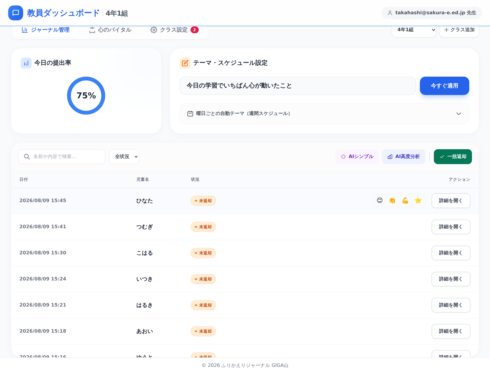

左上のまるいグラフは、名簿に載っている参加中の子の人数を分母にして、今日出した子が何人かを出しています。同じ子が二回出しても一人として数えるので、百パーセントを超えることはありません。朝の会の前にここを見れば、昨日出せていない子が何人いるかがすぐ分かります。

画面の右上でクラスを切り替えられます。専科や複数の学年を持っている先生は、クラスをいくつでも作れます。クラスごとに、シートも名簿もテーマも別々です。ほかの先生が作ったクラスが自分の画面に出ることはありません。

子どもの画面はこうです。まんなかにノートがあって、その上に今日のテーマが出ています。

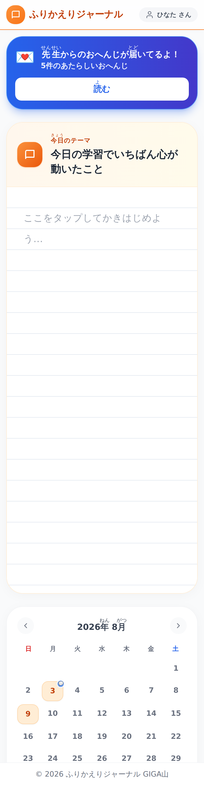

漢字にはふりがなをふってあります。低学年でも、となりの子に聞かずに操作できるようにしたかったからです。書いている途中は自動で保存されるので、まちがえて閉じてしまっても続きから書けます。ただし保存されるのはその端末のブラウザの中だけなので、別の端末では続きになりません。共用のタブレットを使うときは、そこだけ気をつけてください。

そして、止まってしまう子のための道具が右側にあります。

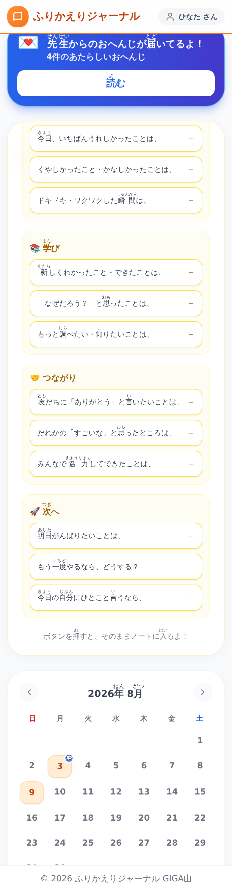

「気持ち」「学び」「つながり」「次へ」の四つに分かれた、十二個の書き出しです。押すと、そのままノートのカーソルの位置に入ります。

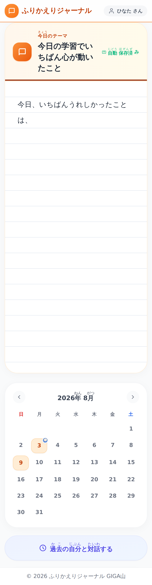

白い紙に向かって「なにか書きなさい」と言われるのがいちばんつらいのだと思います。書き出しの一行さえあれば、そのあとは自分のことばが出てくる。そう考えて、この十二個を選びました。

形から入りたい子には、四つのテンプレートも用意しました。やったこと・わかったこと・つぎにやることのYWT法、つづけること・こまったこと・ためすことのKPT法、5W1H、それに「3つのきづき」です。

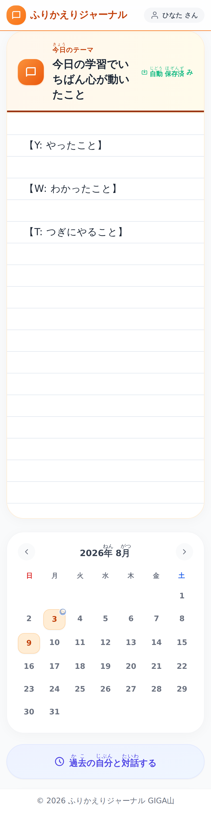

書けたら、今日の気持ちをひとつえらびます。うれしい、くやしい、なるほど、もやもや。この四つだけにしたのは、多すぎると選ぶこと自体が仕事になってしまうからです。写真を一枚つけることもできます。

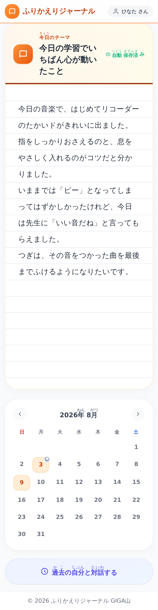

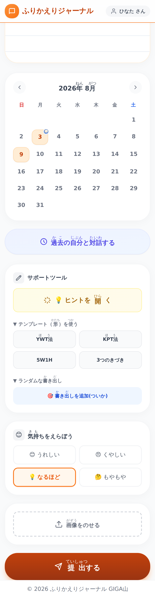

提出すると、画面いっぱいに紙吹雪がまいます。

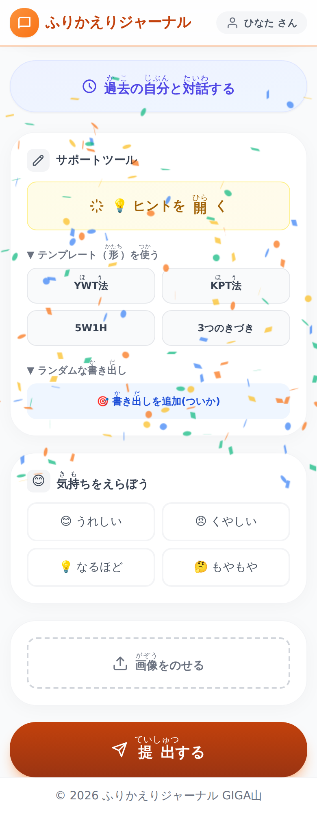

出しただけで終わらせたくなかったので、ここは少しにぎやかにしてあります。ただ、動きが苦手な子もいます。端末の設定で「動きを減らす」にしていると、紙吹雪は出ません。

## 💬 スタンプひとつでも、おへんじは返せる

このアプリでいちばん時間をかけたのは、返すところです。

一覧の行にカーソルを合わせると、四つのスタンプが出ます。押すと、その場で返却済みになります。押しまちがえても取り消せます。

これだけです。読んで、いいなと思ったら、指を一回。三十人ぶんでも数分で終わります。

ちゃんと書きたい子には、詳細を開きます。左に子どもの本文、右にコメント欄という並びです。

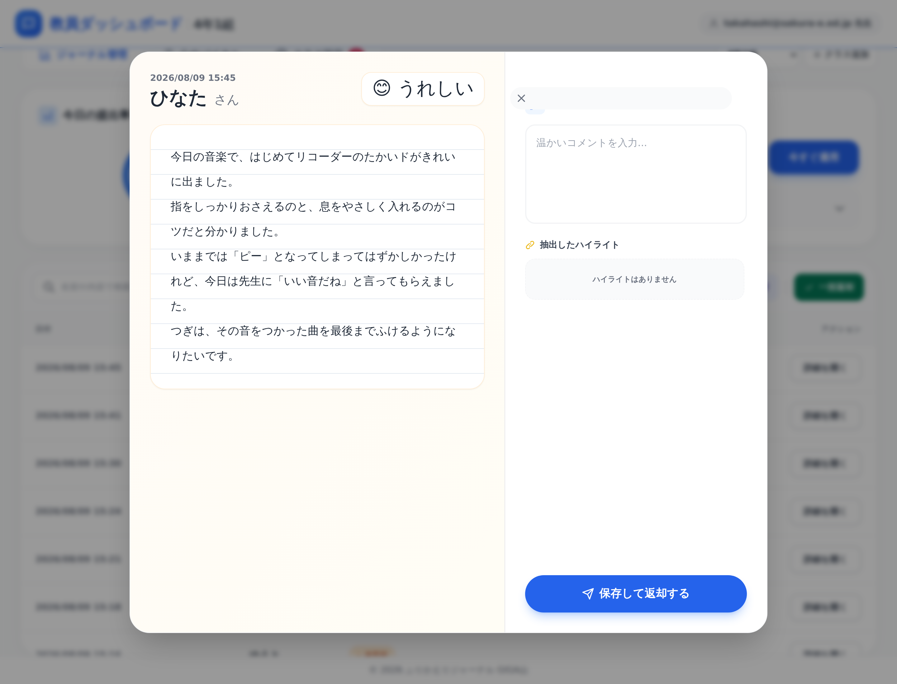

ここでもうひとつできることがあります。本文をドラッグして選ぶと、そこがマーカーとして右側に登録されます。マーカーごとに、ひとことと絵文字をつけられます。

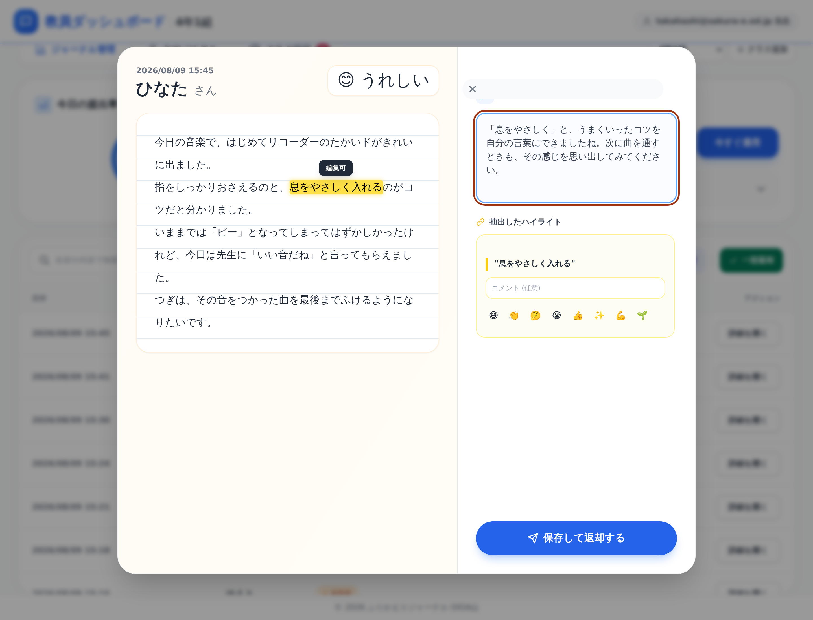

全体へのコメントだけだと、どうしても「がんばりましたね」のような、どの子にも書ける文になりがちです。そうではなく、この子のこの一行がよかった、と場所を指させるようにしたかった。赤ペンで線を引いて「ここ！」と書くのと同じことを、画面の上でやりたかったのです。

返したものは、子どもの画面の上に届きます。

開くと、先生のコメントと、本文に引かれたマーカーがそのまま見えます。

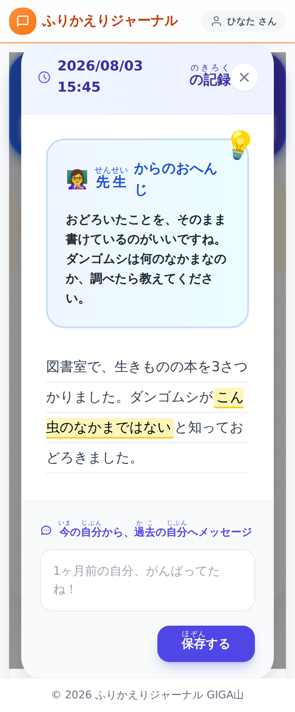

それでも三十人ぶんとなると、時間がない日はあります。そのときのために、Gemini というGoogleのAIにコメント案を作らせる機能もつけました。使うにはAIのキーを自分で取って、クラス設定に入れておきます。

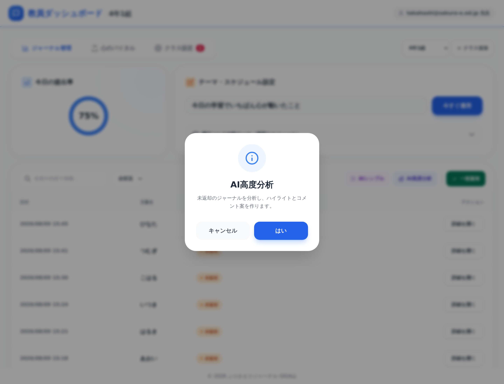

未返却で本文のあるものをまとめて下書きします。ここで大事なのは、AIが作るのはあくまで下書きで、実行しても状況は未返却のままだということです。先生が読んで、直して、それから返します。子どもに届くことばを、AIが勝手に決めてしまう作りにはしたくありませんでした。

なお、AIを使ったときだけ、ジャーナルの本文がGoogleのAIに送られます。使わなければ一度も外へ出ません。キーを入れなければAIのボタンは動かないので、そこは学校の方針に合わせて決めてください。

## 💗 気持ちの14日間を、色で見る「心のバイタル」

もうひとつのタブが「心のバイタル」です。

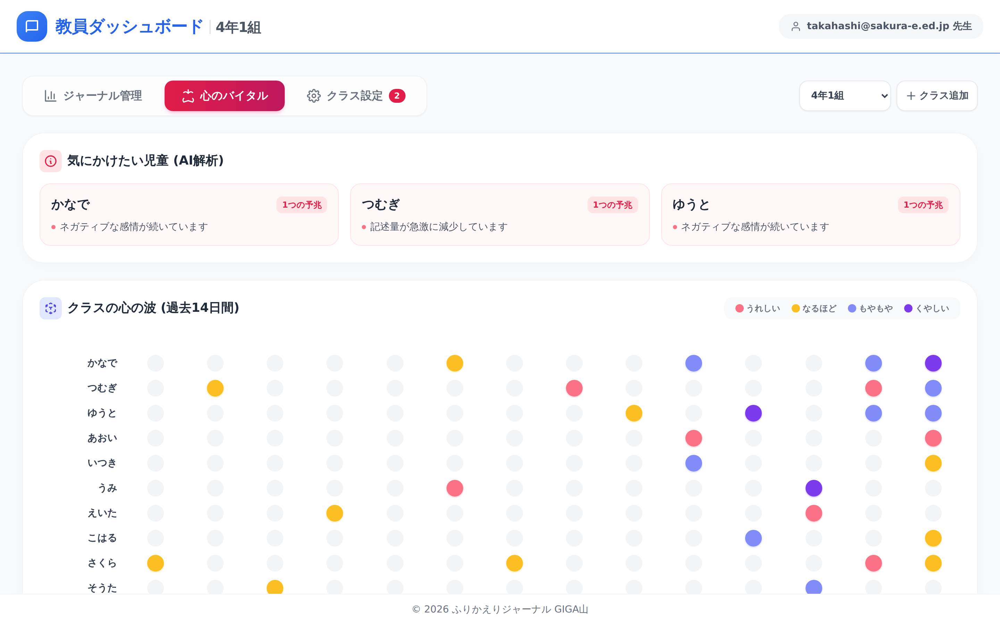

上に出るのは、少し気にかけておきたい子です。条件は二つだけで、直近三件のうち二件以上が「もやもや」か「くやしい」だったとき。それと、提出が三件以上あって、いちばん新しい記述の量が過去の平均の三割を切ったときです。

ここはAIではなく、アプリの中の単純なきまりで判定しています。画面には「AI解析」と出ますが、中身はこの二つのものさしだけです。何を見ているのかが分からないまま「この子が心配です」と言われるより、条件がはっきりしているほうが、先生にとって使いやすいと考えました。

下は、子どもと日付をならべた過去十四日間の表です。

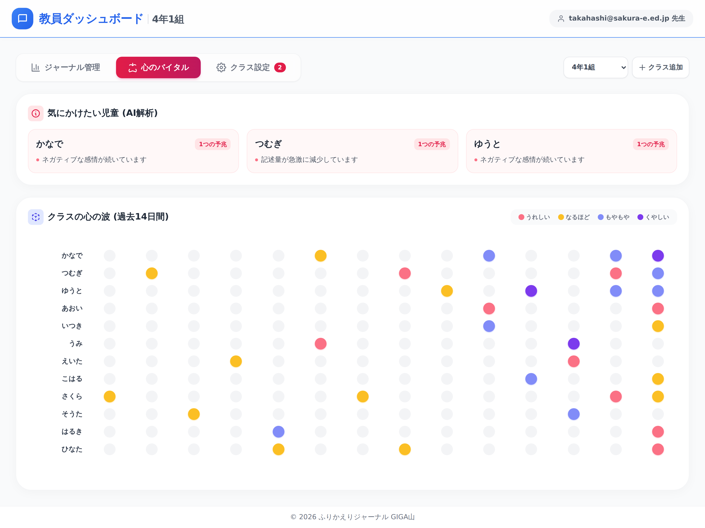

うれしいはローズ、なるほどはアンバー、もやもやはインディゴ、くやしいはバイオレット、出していない日はグレー。丸にカーソルを合わせると、その日の本文が読めます。

一日ぶんの気持ちを見ても、たいていのことは分かりません。今日は「もやもや」でも、それは給食が苦手なものだっただけかもしれない。でも二週間ならべたときに、ある子のところだけ色が沈んでいたら、それは声をかける理由になります。

言っておきたいのは、色がついていないから大丈夫、ではないということです。ここに出る出ないは、あくまできっかけです。教室で見ている顔と合わせて判断してください。そのつもりで作りました。

子どものほうにも、自分の記録をふりかえる入り口があります。カレンダーは、書いた日に色がつき、おへんじがついた日にはしるしが出ます。

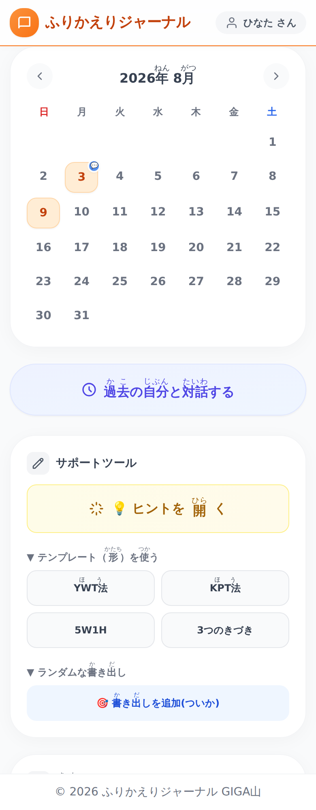

そして「過去の自分と対話する」を押すと、一ヶ月以上前の自分の記録がランダムで一件出てきます。

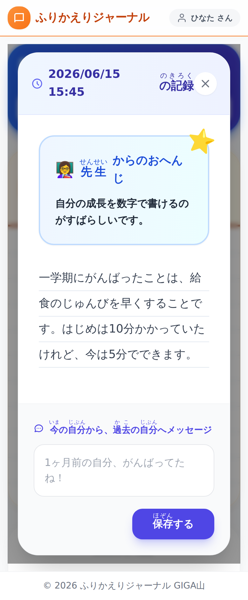

下の欄に、今の自分から過去の自分へメッセージを残せます。一ヶ月前にできなかったことが、今はできている。そのことに自分で気づく瞬間があればいいなと思って入れました。

## ✨ 導入のメリット

三つのいいことが期待できます。

一つ目は、返せなかったノートが積み上がらなくなることです。スタンプ一回で返却として成立するので、時間のない日でも「今日は返せなかった」がなくなります。ていねいに書ける日はマーカーを引けばいい。全部か無かではなく、その日にできるぶんだけ返せる作りにしたのが、いちばん効くところだと思っています。

二つ目は、書けない子が置いていかれにくくなることです。書き出しの十二個とテンプレートの四つは、「なにを書けばいいの」に対して先生が毎回答えていた内容を、あらかじめ画面に置いたものです。えんぴつが止まっている子のところへ行く前に、その子が自分で一歩目を踏み出せる。回る先が減るぶん、本当に見てあげたい子のところに長くいられるようになるはずです。

三つ目は、気づきにくい変化に手がかりができることです。毎日おとなしく提出していた子の記述が、ある日から三行になった。紙のノートだと気づきにくいところですが、十四日ぶんを一枚で見れば分かります。データが先生の代わりに判断するのではなく、先生が声をかける順番を決める材料になる。そういう使い方を想定しています。

## 🛠️ 【管理者向け】導入手順

情報担当の先生に確認されそうなことを、先に書いておきます。

データの置き場所です。クラスを作ると、そのクラス専用のスプレッドシートが、担任の先生自身のGoogleドライブの中にできます。持ち主は先生です。アプリを置いた側のアカウントは編集者として入りますが、学校の外に別のデータベースを持つことはありません。アプリを使わなくなっても、記録は先生の手もとに残ります。

子どもの権限です。子どもにはスプレッドシートの権限が一切つきません。シートのURLを知っていても開けない作りです。子どもの画面に返る情報の中では、メールアドレスは別の記号に置きかえられます。

配り方です。クラスを作ると、児童用のURLとQRコードが出ます。これを配れば、子どもはGoogleでサインインするだけで入れます。名簿にメールアドレスを登録しておいた子は、そのまま参加できます。

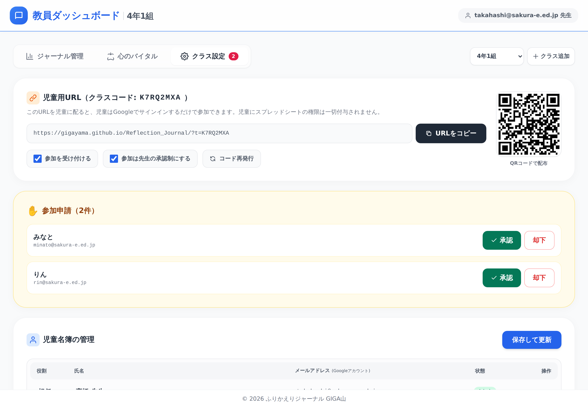

名簿にない子から入ろうとすると、参加申請として先生に届きます。承認するまで中には入れません。

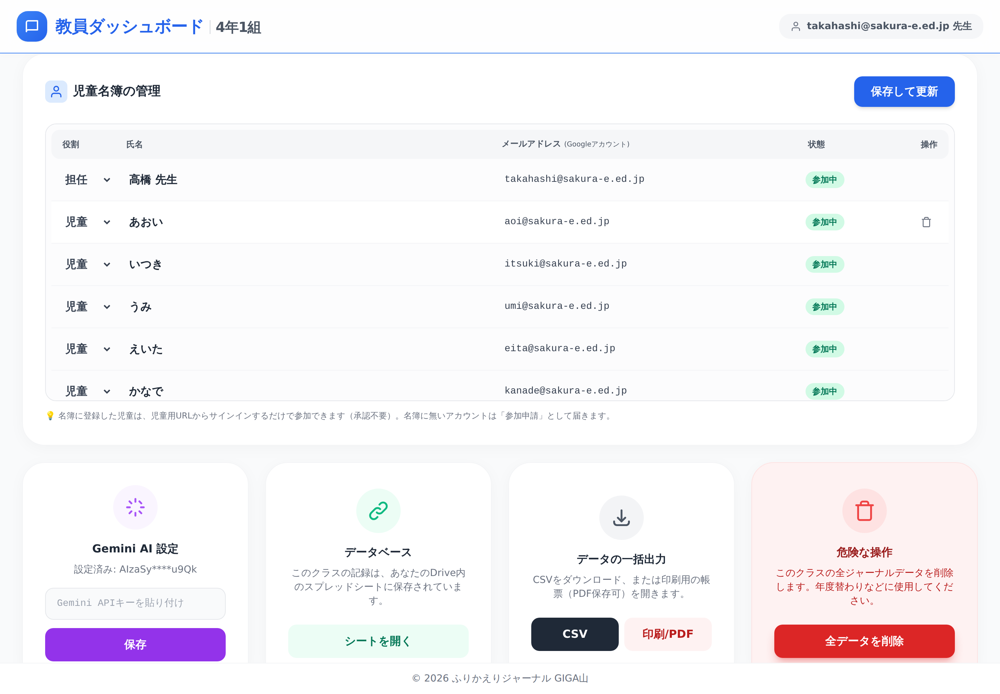

クラスのURLについているコードは、八文字で、まぎらわしい文字を除いた三十二種類の文字からできています。組み合わせは一兆通りをこえます。ただ、このコードは合いかぎではありません。宛先です。仮にどこかで人に見られても、名簿にない人は承認待ちで止まります。それでも心配なときは、コードを作り直せます。作り直すと、前に配ったURLは使えなくなります。

名簿は画面の上でそのまま直せます。行を足して、名前とアドレスを入れて、保存するだけです。

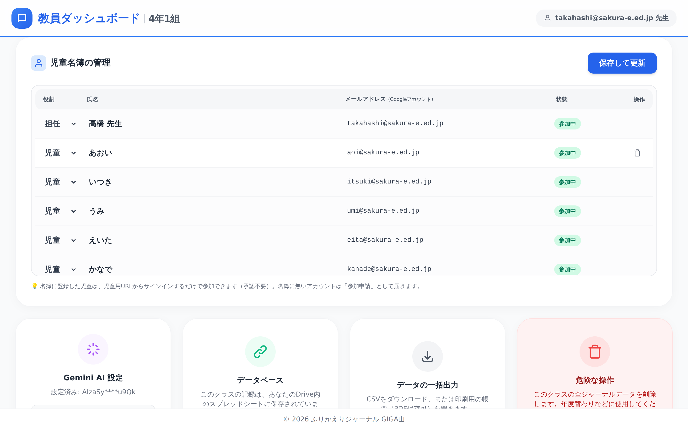

年度末の書き出しも用意しました。CSVでのダウンロードと、子どもごとに改ページした印刷用の帳票です。帳票はブラウザの印刷から、PDFとして保存できます。

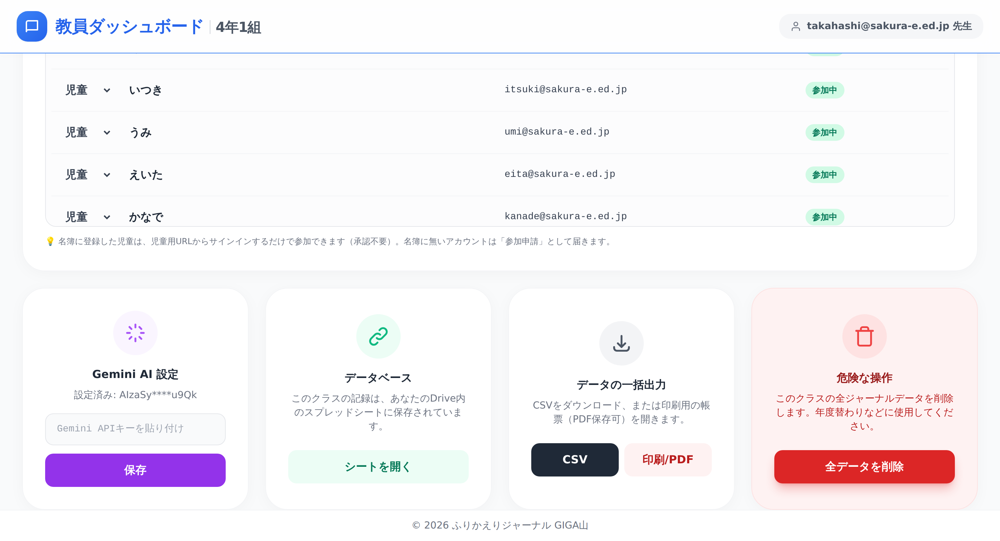

校内のフィルタリングについてです。通してもらう必要があるのは、Googleのログイン、Googleのアプリを動かしている場所、それにこのアプリを置いてあるGitHubの公開ページです。具体的には accounts.google.com、script.google.com、googleusercontent.com、docs.google.com、それから配布ページのアドレスになります。QRコードは先生のブラウザ内で作るため、外部のQR生成サービスを通す必要はありません。AIを使う場合は generativelanguage.googleapis.com も要ります。

画面を動かす部品は、すべてアプリの中に入れてあります。以前はよくある配信元から読みこむ作りで、初回に三千キロバイトほど読んでいました。学校のネットワークがそこを塞いでいると、子どもの画面が白いまま何も出ません。今は自分側に持たせて、初回に読むぶんは278.1キロバイトです。文字の形を決めるフォントだけは外から読みますが、届かなくても字の形が変わるだけで、読めなくなることはありません。

そのほか、押さえておいていただきたいことを並べます。

- インターネットがつながっていないと使えません。書いたものを先生のシートに届ける仕組みだからです
- 下書きと、おへんじを読んだかどうかは、その端末のブラウザにだけ残ります。別の端末には引き継がれません
- サインインの情報はタブを閉じると消えます。共用端末で次の子に引き継がれることはありません
- 写真は、送る前に端末の中で小さくしてから保存されます
- アプリが使うGoogleの権限は三つだけです。ドライブ全体を見る権限は求めません

設置そのものは、GASとGitHub Pagesを触ったことがあれば一時間ほどで終わります。手順はリポジトリのREADMEに書いてあります。設置がうまくいっているかを自動でたしかめるページも用意しました。共通のURLのうしろに diag.html をつけて開くだけです。先生から「開けません」と言われたとき、まずここを見てもらえば、設定の問題なのか回線の問題なのかが切り分けられます。

先に言っておくと、今の作りでできないこともあります。ジャーナルを一件だけ消すこと、子どもから先生へメッセージを送ること、子ども同士でおたがいの記録を読むこと、それにメールでのお知らせは、どれもありません。書き出しの絞りこみも、画面のボタンからは全期間・全員での出力になります。あとから「あると思っていた」となるより、先に書いておいたほうが親切だと思うので並べておきます。

## 📖 【利用者向け】使い方のガイド

先生がはじめる手順です。

1. 配られた共通のURLを開き、Googleでサインインします
2. 「クラスを作成する」を押し、クラス名を入れます。数秒で、自分のドライブにこのクラスのシートができます
3. クラス設定のタブを開き、児童用URLをコピーします。QRコードを電子黒板に映してもかまいません
4. 同じタブの名簿に、子どもの名前とGoogleアカウントを入れて保存します。ここに載っている子は、承認なしで参加できます
5. ジャーナル管理のタブで今日のテーマを入れ、「今すぐ適用」を押します

子どもが書く手順です。

1. 配られたURLかQRコードを開き、Googleでサインインします
2. まんなかのノートをタップして書きはじめます
3. 手が止まったら「ヒントを開く」を押し、使いたい書き出しをえらびます
4. 今日の気持ちをひとつえらびます
5. 「提出する」を押します

先生が返す手順です。

1. ジャーナル管理のタブを開きます
2. さっと返すときは、行に出る四つのスタンプからひとつを押します。これで返却済みになります
3. ことばを添えるときは「詳細を開く」を押し、コメントを書きます
4. 本文の中でここを見てほしいという場所があれば、その部分をドラッグして選びます。マーカーとして右側に入るので、ひとことと絵文字をつけます
5. 「保存して返却する」を押します

子どもがおへんじを読む手順です。

1. 画面の上に出たしるしから「読む」を押します
2. 先生のコメントと、本文に引かれたマーカーが見えます
3. あとから読み返すときは、左のカレンダーで、しるしのついた日をタップします

## 📝 まとめ

このアプリでやったのは、ふりかえりを増やすことではありません。ふりかえりを続けるための、しんどさを減らすことです。

書けない子には最初の一行を。返す先生には、スタンプ一回という逃げ道を。そして毎日の記録が積み上がったら、それを十四日ぶんの色にして返す。そこまでが一続きになっていないと、結局どこかで止まってしまうと考えました。

ICTを入れる目的は、効率化そのものではないと思っています。丸付けや集計に取られていた時間が少し戻ってきて、そのぶん子どもの顔を見る時間が増える。増えた時間で、色が沈んでいた子のところへ行って「最近どう」と聞ける。そこまで行けたら、はじめて入れた意味があったと言えるのだと思います。

このアプリが、その時間を少しでも作れるものになっていたらうれしいです。使ってみて、ここが使いにくい、こういう機能がほしい、というところがあれば、ぜひ教えてください。作った人間がひとりで考えているうちは、どうしても抜けが出ます。

一歩踏み出そうとする先生を、私はいつでも全力で応援しています。
